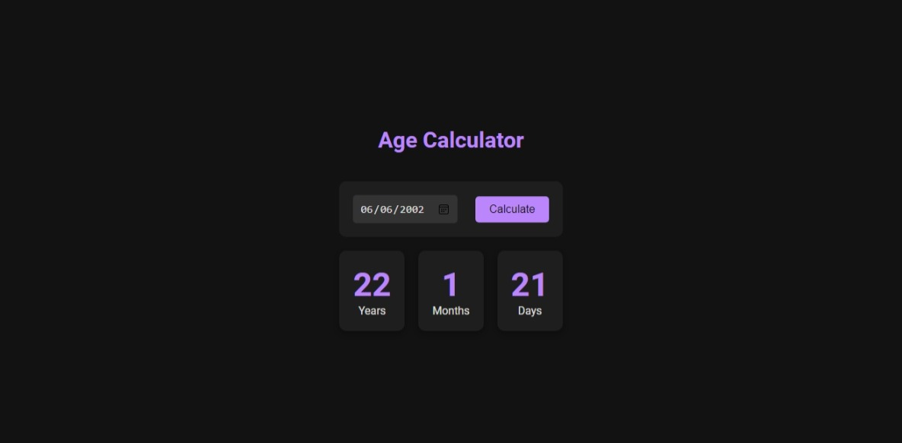

# Age Calculator

## A basic age calculator using HTML, CSS and JavaScript.

## Description

This is a simple age calculator that calculates the age of a person based on the date of birth provided. It also calculates the number of days, months and years between the date of birth and the current date.
